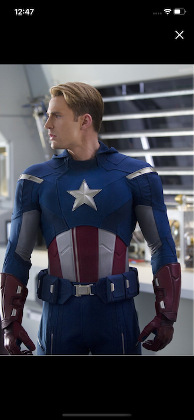

# iMovieRate


## Table of Contents

  - [Table of Contents](#table-of-contents)
  - [Description](#description)
  - [Installation](#installation)
  - [ScreenShots](#screenshots)
  - [Videos and gifs](#videos)
  - [Planned Features](#planned-features-in-development)
  - [License](#license)


## Description
Mobile iOS/Android app for searching movie data and creating "to-watch" lists. Allows user to search, browse and store most relevent information on thousands of movies. Displays most trending movies of the day/week and movies, that are screened in theatres now.
App utilizes fetching data from several API's (The Movie Database, The Open Movie Database, Kinopoisk Unofficial) and displays it in a user friendly manner.

Supports both iOS and Android, utilizes React Native and Expo.io framework on client side and custom-build Express server with MongoDB on the server side.

For each user-selected movie displays:
  * general information:
    * title
    * release year
    * MPA rating
    * runtime
  * official poster
  * list of genres
  * plot description
  * movie tagline
  * ratings from world famous review-aggregation resourses
    * IMDb
    * Metascore
    * Rotten Tomatoes
  * top billed cast:
    * actor image
    * name
    * character
  * director and writers
  * official movie trailer
  * similar movies recommended for the user:
    * poster
    * title
    * release year
  * movie stills and images

## Installation
clone this repository
```bash
$ git clone https://github.com/ozzychel/iMovieRate.git
```
go to root folder
```bash
$ cd iMovieRate
```
run npm install
```bash
$ npm install
```
....in development
```bash
$ add instructions
```
## Screenshots

<p float="left">
  
  
  
  
</p>
<p float="left">
  
  
  
  
</p>
<p float="left">
  
  
  
  
</p>

## Videos
....in development
## Planned Features in development
* browsing actors and displaying relevant information
* browsing tv shows and tv series
* login view with biometrics support
* display movie of the day in Home tab


## License
[MIT](https://choosealicense.com/licenses/mit/)