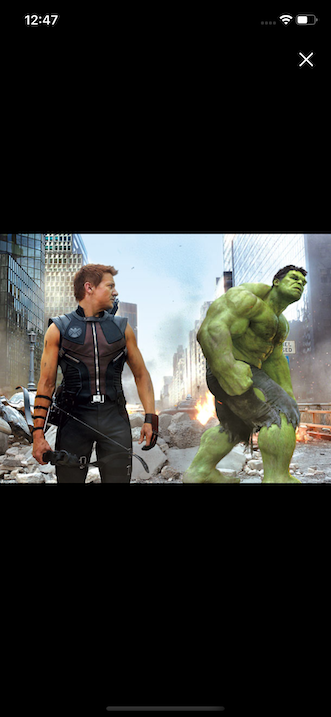

# iMovieRate

  

## Table of Contents

  - [Table of Contents](#table-of-contents)
  - [Description](#description)
  - [Gifs](#gifs)
  - [ScreenShots](#screenshots)
  - [Videos](#video)
  - [Installation](#installation)
  - [Planned Features](#planned-features-in-development)
  - [License](#license)

## Description
Mobile iOS/Android app for searching movie data and creating "to-watch" lists. Allows user to search, browse and store most relevant information on thousands of movies. Displays most trending movies of the day/week and movies that are screened in theaters today.
App utilizes fetching data from several API's ([The Movie Database](http://https://www.themoviedb.org/), [The Open Movie Database](http://www.omdbapi.com/), [KP Unofficial](https://kinopoiskapiunofficial.tech/)) and displays it in a user-friendly manner.

Supports both iOS and Android, utilizes React Native and Expo frameworks on client side and custom-built Express server with MongoDB on the server side.

For each user-selected movie displays:
  * general information: title, release year, MPA rating, runtime
  * official poster
  * list of genres
  * plot description
  * movie tagline
  * ratings from world famous review-aggregators: [IMDb](http://https://www.themoviedb.org/), [Metacritics](https://www.metacritic.com/), [Rotten Tomatoes](https://www.rottentomatoes.com/)
  * top billed cast: actor image, name, character
  * director and writers
  * official movie trailer
  * similar movies recommended for the user: poster, title, release year
  * movie stills and images

App provides a user-friendly interface for creating to-watch lists. Add or remove movies with just one tap on a screen, the app will do the rest of the job for you by securely storing your to-watch list in a database and updating all actual information on the screen in a real-time manner.
 

Like to have long lists and don't bother to remember what you've put in there? No worries...iMovieRate will automatically check if a movie was added to your watchlist literally on every screen of the app, even in random search results, "Trending" or "In Theatres Now" (just look for the ★ icon).
 

Browse new releases or beloved classic hits, unveil hidden sides of cinematography, watch trailers and images, read plot descriptions or check up on celebrities. Add your picks to the list and enjoy.... 

## Gifs

  

## Screenshots

  
  
  
  

  
  
  
  

  
  
  
  

## Video

app video on [Youtube](https://youtu.be/bd-IM4Bdd7I)

## Installation
**IMPORTANT:**  
App utilizes http requests to *several* API.
To get full functionality, including online search on user input, you will need to obtain API keys (~6 mins), see below for instructions: 
 

  
installation with API keys (~10 mins)

  1. clone this repository:

    git clone https://github.com/ozzychel/iMovieRate.git

  2. go to root folder:

    cd iMovieRate

  3. install dependencies:

    npm install

  4. run mongoDB seeding script:

    npm run db-seed

  5. in root folder open `config.js' file in your favorite IDE and follow the instructions
  6. to obtain TMDb api key:

  - visit https://www.themoviedb.org/ and sign up for an account
  - in your account "Settings" click "API" in left sidebar
  - obtain your API key and paste it as a value of tmbd_api_key in config.js

  7. to obtain OMDb api key:
  - visit http://www.omdbapi.com/, in top navbar click 'API key'
  - type your email, obtain API key and paste it as a value of omdb_api_key in config.js

  8. to obtain KP api key:
  - visit https://kinopoiskapiunofficial.tech/ and click 'Sign Up'
  - obtain your API key and paste it as a value of kp_unof_api_key in config.js

  9. start app server:

   npm run prod-server

  10. open new terminal window
  11. start Expo service:

    npm start

  12. in newly opened browser window:

  - click `"Run on iOS simulator"` for iOS (requires Xcode installed)
  - click `"Run on Android device/emulator"` for Android (requires Android Studio installed)
  - scan QR code with Expo Client app on your mobile phone (easiest way)
    - link to [App store](https://apps.apple.com/us/app/expo-client/id982107779) for Apple device
    - link to [PlayStore](https://play.google.com/store/apps/details?id=host.exp.exponent) for Android device

   

 

If you **don't want to mess with api keys** its ok, use app with **mock data** provided, continue as follows:
 
 

  
installation without API keys with mock data (search displays mock data)

  1. clone this repository:

    git clone https://github.com/ozzychel/iMovieRate.git

  2. go to root folder:

    cd iMovieRate

  3. install dependencies:

    npm install

  4. run mongoDB seeding script:

    npm run db-seed

  5. start app server:

    npm run mock-server

  6. open new terminal window
  7. start Expo service:

    npm start

  8. in newly opened browser window:

  - click `"Run on iOS simulator"` for iOS (requires Xcode installed)
  - click `"Run on Android device/emulator"` for Android (requires Android Studio installed)
  - scan QR code with Expo Client app on your mobile phone (easiest way)
    - link to [App store](https://apps.apple.com/us/app/expo-client/id982107779) for Apple device
    - link to [PlayStore](https://play.google.com/store/apps/details?id=host.exp.exponent) for Android device

   

 

## Planned Features in development
* browsing actors and displaying relevant information
* browsing tv shows and tv series
* login screen with biometrics support
* display movie of the day in Home tab

## License
[MIT](https://choosealicense.com/licenses/mit/)